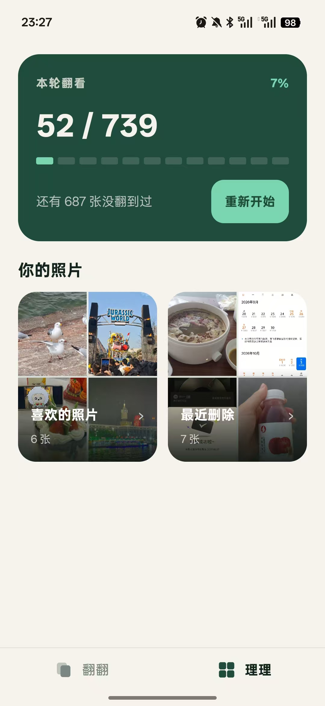

  

<h1 align="center">翻翻</h1>

  随手翻一翻，回忆一篇篇

  
  
  
  

翻翻是一款支持 Android 和 iOS 的相册浏览与整理应用，它把相册变成一叠可以四向翻动的卡片，让随机回顾和同日浏览在同一套手势里完成。

  
  &nbsp;&nbsp;
  

## 功能

- 沉浸式浏览照片、实况照片和视频。
- 使用持久化随机队列记录每轮浏览进度，退出应用或进程重启后仍可继续。
- 双击标记喜欢，并在“理理”中集中查看。
- 按相簿查看照片，也可隐藏不想翻看的相簿。
- 为单张媒体保存本地评论，支持回复和删除。
- 视频支持播放、暂停、进度拖动和静音。
- 动态照片自动播放一次，结束后回到静态封面，长按照片或点按右上角标志可重播。
- Android 版可在“最近删除”中批量恢复或彻底删除；iOS 版由系统“照片”管理最近删除。

## 手势

| 操作       | 结果             |
| -------- | -------------- |
| 上滑       | 随机翻到本轮尚未浏览的下一项 |
| 下滑       | 回看访问历史中的上一项    |
| 左滑 / 右滑  | 浏览同一拍摄日期内的相邻媒体 |
| 双击       | 标记或取消喜欢        |
| 长按视频     | 二倍速播放          |
| 长按实况照片   | 从头播放一次         |
| 长按回收站缩略图（Android） | 进入多选模式，可全选 |

## 隐私

翻翻不申请网络权限，因此不会通过网络上传媒体。

应用只在本机数据库中保存：

- 喜欢项的媒体 ID；
- 留言内容；
- 浏览进度、当前项和随机队列；
- 由翻翻发起删除的媒体 ID。

## 参与贡献

欢迎通过 Issue 讨论问题、交互方案和兼容性案例，涉及界面请附前后截图。

## 许可证

本项目采用 [Apache License 2.0](LICENSE) 开源。
